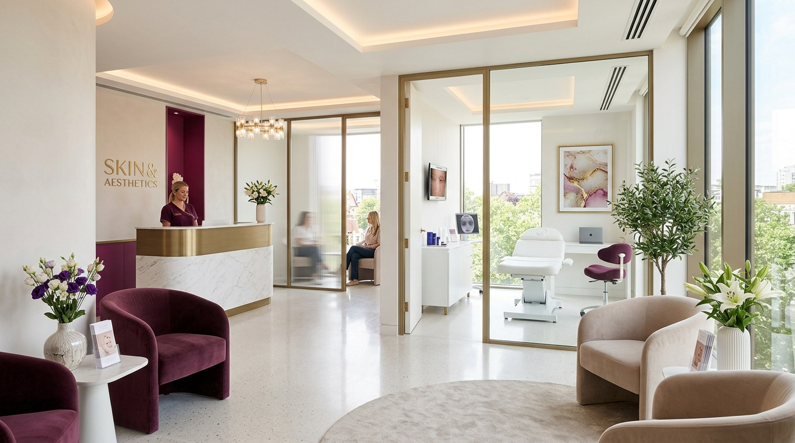

# Auraederm Skin Solutions

<p align="center">
	
</p>

<p align="center">
	A modern, responsive clinic website for Auraederm Skin Solutions, built with React, Vite, TypeScript, and Tailwind CSS.
</p>

<p align="center">
	
	
	
</p>

## Features

- Hero section with clinic imagery and booking call-to-action
- Doctor profile and clinic overview
- Services section with treatment categories
- Before-and-after gallery
- Community welfare highlights
- Contact section with booking and service preselection
- Mobile-friendly floating call button

## Gallery

<table>
	<tr>
		<td align="center">
			
			<br />
			<strong>Clinic Hero</strong>
		</td>
		<td align="center">
			
			<br />
			<strong>Doctor Profile</strong>
		</td>
		<td align="center">
			
			<br />
			<strong>Treatment Experience</strong>
		</td>
	</tr>
</table>

## Tech Stack

- React 19
- TypeScript
- Vite
- Tailwind CSS 4
- Lucide icons

## Getting Started

Install dependencies:

```bash
npm install
```

Start the development server:

```bash
npm run dev
```

Build for production:

```bash
npm run build
```

Type-check the project:

```bash
npm run lint
```

Preview the production build:

```bash
npm run preview
```

## Project Structure

```text
src/
	App.tsx                Main page composition
	main.tsx               React entry point
	data.ts                Clinic content and configuration
	types.ts               Shared TypeScript types
	index.css              Global styles
	components/            Page sections and UI blocks
	assets/images/         Clinic imagery used throughout the site
```

## Notes

- Image assets are imported directly from `src/assets/images` so Vite can bundle them correctly.
- The app is currently focused on the public-facing marketing experience for the clinic.
